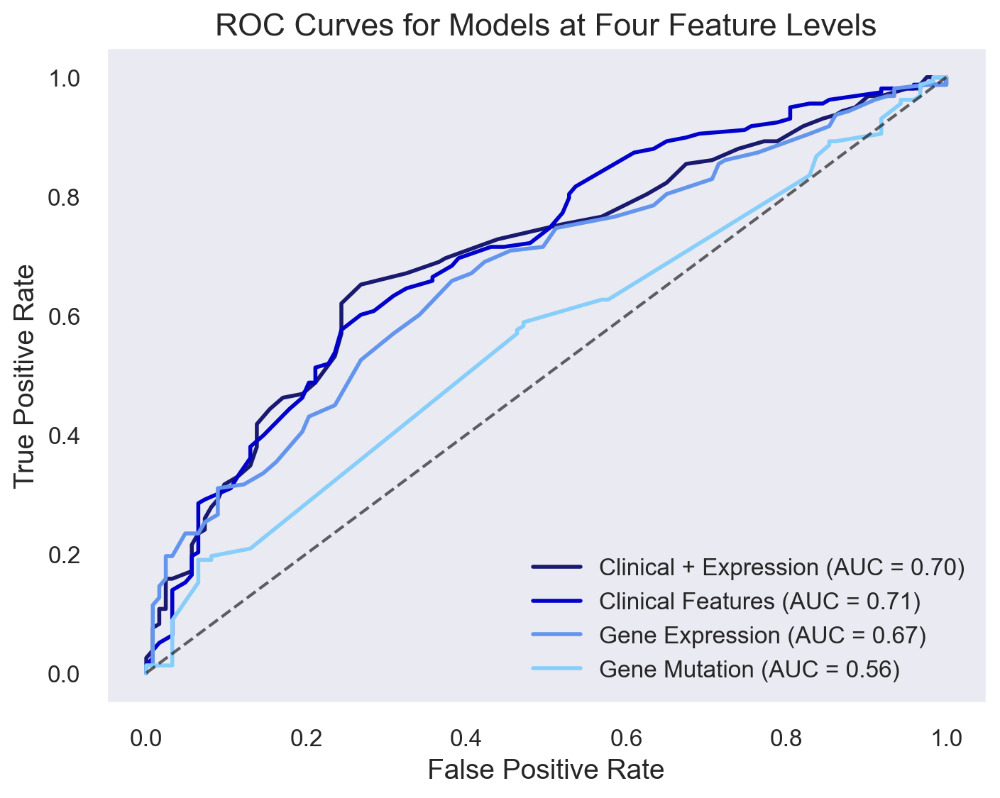
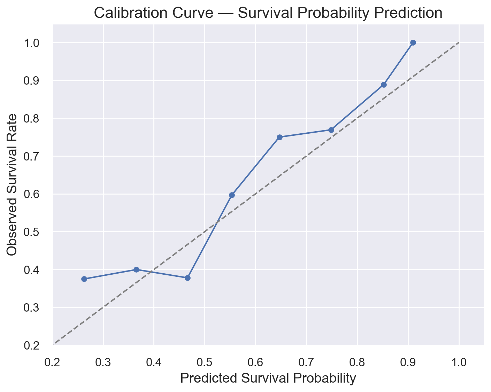
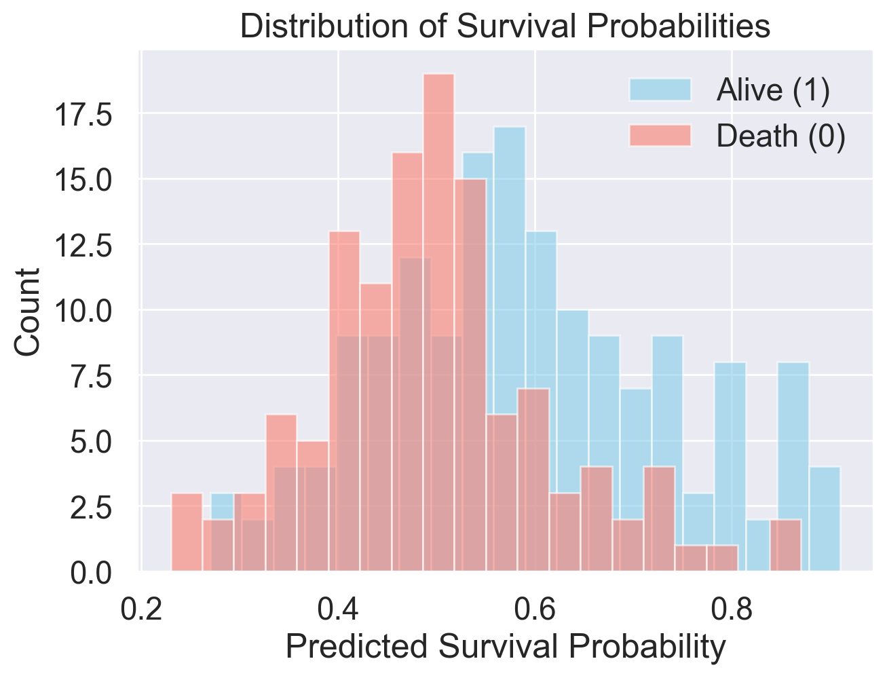

# Machine-Learning Investigation on Breast Cancer Prognosis For Clinical Decision Support

## Overview

This project implements a machine‐learning and survival‐analysis workflow for breast cancer prognosis using the [METABRIC](https://www.kaggle.com/datasets/raghadalharbi/breast-cancer-gene-expression-profiles-metabric) dataset. The goal is to build a predictive model, specifically Random Forest, of survival probability for breast cancer patients by leveraging clinical and/or molecular data, as well as to identify key biomarkers for the prognosis.

## Usage

Open the notebook `breast_cancer_survival_prediction.ipynb` and step through the cells. The code is structured to:

- Load the dataset `METABRIC_RNA_Mutation.csv`

- Clean and preprocess the data, which includes feature layers of clinical attributes, gene expressions, and mutations

- Conduct statistical analysis and keep only features that demonstrated a statistically significant difference across the survival groups 

- Train and test Random Forest models on four feature layers: clincal, gene expression, mutation, and combination of clincal attributes and gene expression

- Evaluate performance and generate output visualizations

Feature evaluation with survival analysis is in `/feature_anlysis`:

....

## Results and Interpretation

1. Model performance comparsion

    

        
    | Model             |   Accuracy |   Precision |   Recall |   F1 Score |   AUC-ROC |
    |------------------|------------|-------------|----------|------------|-----------|
    | Clinical Features|       0.65 |        0.68 |     0.72 |       0.70 |      0.71 |
    | Gene Expression  |       0.64 |        0.67 |     0.71 |       0.69 |      0.67 |
    | Gene Mutations   |       0.54 |        0.56 |     0.84 |       0.67 |      0.56 |
    | Combined Model   |       0.67 |        0.71 |     0.70 |       0.70 |      0.70 |

    Although the Clinical-Only model achieved the highest AUC of 0.71, the Combined Model (combination of clinical and gene expression), which was chose as the final model, demonstrated the best overall performance with superior accuracy (0.67), precision (0.71), and F1-score (0.70).

2. Evaluation of survival probability predictions

    

    
    
    

    The Calibration Curve shows that the Combined Model generates predictions that closely match the observed survival rates, while the survival probability distribution shows clear shifts in and separation of the distribution of alive and death groups, demonstracting the Combined Model's capacity to produce reliable, well-calibrated survival probability estimates. 