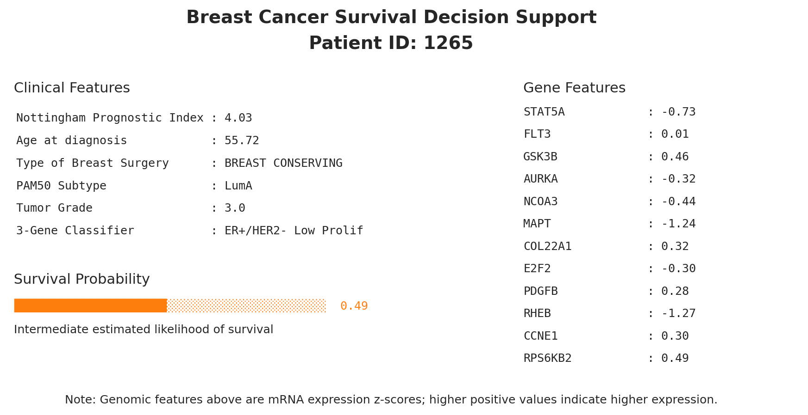

# Machine-Learning Investigation on Breast Cancer Prognosis For Clinical Decision Support

## Overview

This project implements a machine‐learning and survival‐analysis workflow for breast cancer prognosis using the [METABRIC](https://www.kaggle.com/datasets/raghadalharbi/breast-cancer-gene-expression-profiles-metabric) dataset. The goal is to build a predictive model, specifically Random Forest, of survival probability for breast cancer patients by leveraging clinical and/or molecular data, as well as to identify key biomarkers for the prognosis.

## Usage

Open the notebook `main_predict.ipynb` and step through the cells. The code is structured to:

- Load the dataset `METABRIC_RNA_Mutation.csv`

- Clean and preprocess the data, which includes feature layers of clinical attributes, gene expressions, and mutations

- Conduct statistical analysis and keep only features that demonstrated a statistically significant difference across the survival groups 

- Train and test Random Forest models on four feature layers: clincal, gene expression, mutation, and combination of clincal attributes and gene expression

- Evaluate performance and generate output visualizations

Feature evaluation with survival analysis is in `/feature_anlysis`:

To be notied, we have `overall_survival == 0` = death (event), `1` = alive (censored)  

We performs Kaplan–Meier survival analysis for **every feature**.

Handling all variable types:  
   - Continuous variables → divided into quartiles (or median split if low spread)  
   - Known ordinal variables (e.g. histologic grade 1/2/3) → forced to categorical  
   - Categorical / binary variables → used as-is (empty strings and whitespace cleaned to NA)  \

The whole analysis procedure is: 

For each feature it automatically:  
   - Builds the KM curve  
   - Performs log-rank test  
   - Calculates HR + 95% CI (single HR for binary variables; pairwise HRs vs reference for multi-level variables)  
   - Shows a publication-quality plot with p-value and HR directly on the figure  
   - all results saved as high-resolution PNG in the folder `KM_plots/`  

The whole process with additional dashboard generated is in `predict_with_dashbord.ipynb`:

- Generate a prototype CDS dashboard via `plot_cds_dashboard(...)`, producing a patient-level survival report with clickable gene annotations.

## Results and Interpretation

1. Model performance comparsion

    

        
    | Model             |   Accuracy |   Precision |   Recall |   F1 Score |   AUC-ROC |
    |------------------|------------|-------------|----------|------------|-----------|
    | Clinical Features|       0.65 |        0.68 |     0.72 |       0.70 |      0.71 |
    | Gene Expression  |       0.64 |        0.67 |     0.71 |       0.69 |      0.67 |
    | Gene Mutations   |       0.54 |        0.56 |     0.84 |       0.67 |      0.56 |
    | Combined Model   |       0.67 |        0.71 |     0.70 |       0.70 |      0.70 |

    Although the Clinical-Only model achieved the highest AUC of 0.71, the Combined Model (combination of clinical and gene expression), which was chose as the final model, demonstrated the best overall performance with superior accuracy (0.67), precision (0.71), and F1-score (0.70).

2. Evaluation of survival probability predictions

    

    
    
    

    The Calibration Curve shows that the Combined Model generates predictions that closely match the observed survival rates, while the survival probability distribution shows clear shifts in and separation of the distribution of alive and death groups, demonstracting the Combined Model's capacity to produce reliable, well-calibrated survival probability estimates.

## Output
### Prototype Clinical Decision Support Dashboard

To translate the model’s predictions into a clinically usable format, we implemented a prototype clinical decision support (CDS) dashboard. The dashboard presents a patient’s calibrated survival probability together with the most influential clinical and gene-expression features validated through Random Forest feature importance and Kaplan–Meier survival analysis.
    
The interface includes:

- A color-coded survival probability bar (green = high survival probability, orange = intermediate, red = low)

- A left panel summarizing key clinical features

- A right panel listing top gene-expression markers, with hyperlinked gene symbols (NCBI Gene) for rapid evidence lookup

  

The SVG version preserves active hyperlinks for gene symbols:  **[Open SVG Dashboard (with clickable gene links)](results/cds_dashboard_patient_1265.svg)**
